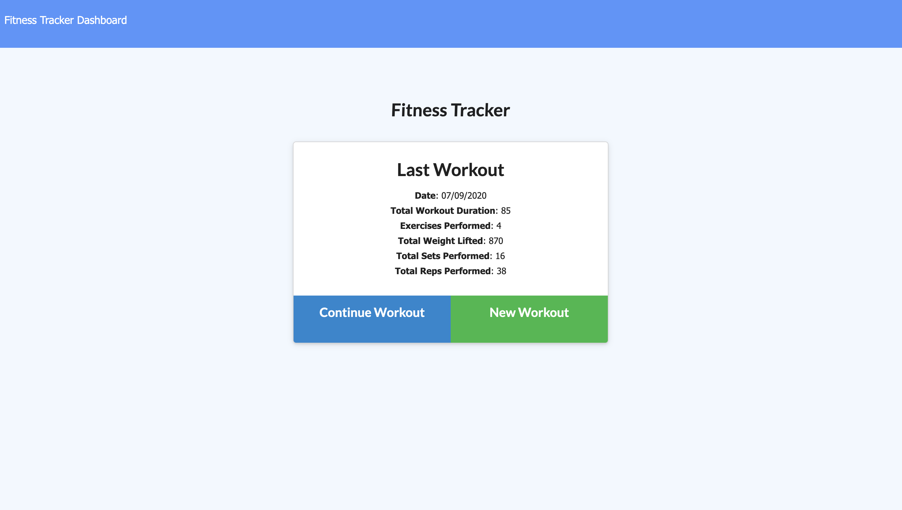

[](https://github.com/xtineroq?tab=followers)

# Fitness Tracker

## Description
➤ A workout tracker app that uses MongoDB with a Mongoose Schema and routes created with Express.

## Table of Contents
* [Installation](#installation)
* [Usage](#usage)
* [License](#license)
* [Contributing](#contributing)
* [Tests](#tests)
* [Questions](#questions)
* [Screenshots](#screenshots)
* [Deployed Application](#deployed-application)

## Installation
```
Start with npm run seed to generate seeds for the database. Then run npm i to install all dependencies.
```

## Usage
➤  Once done with the above, proceed with npm start to start the application.

## License
This app is covered under the following license/s:


## Contributing
➤ This is an open-source project. Please feel free to contribute. Reach out to the author for more details.

## Tests
```
None
```

## Questions
Please direct all questions to:

👤 https://github.com/xtineroq

📧 mcroque89@gmail.com

## Screenshots



## Deployed Application
[View on Heroku](https://nameless-thicket-04347.herokuapp.com/)
